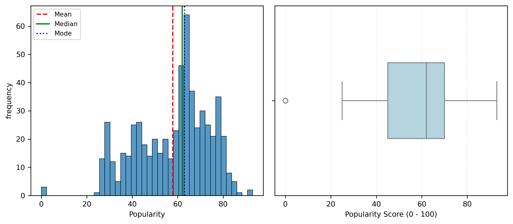
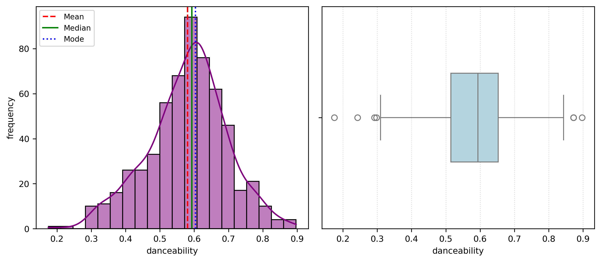
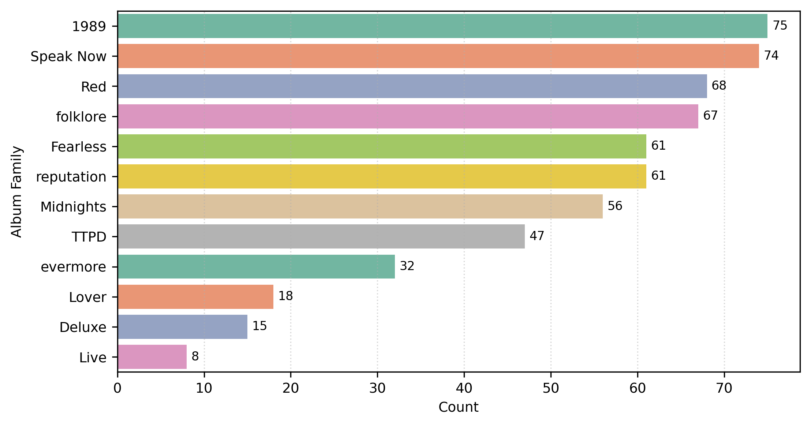
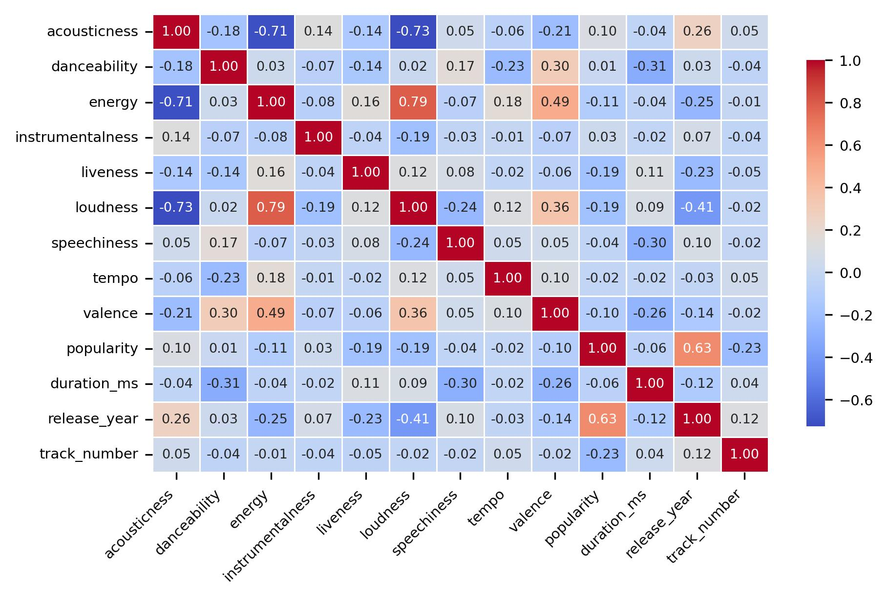
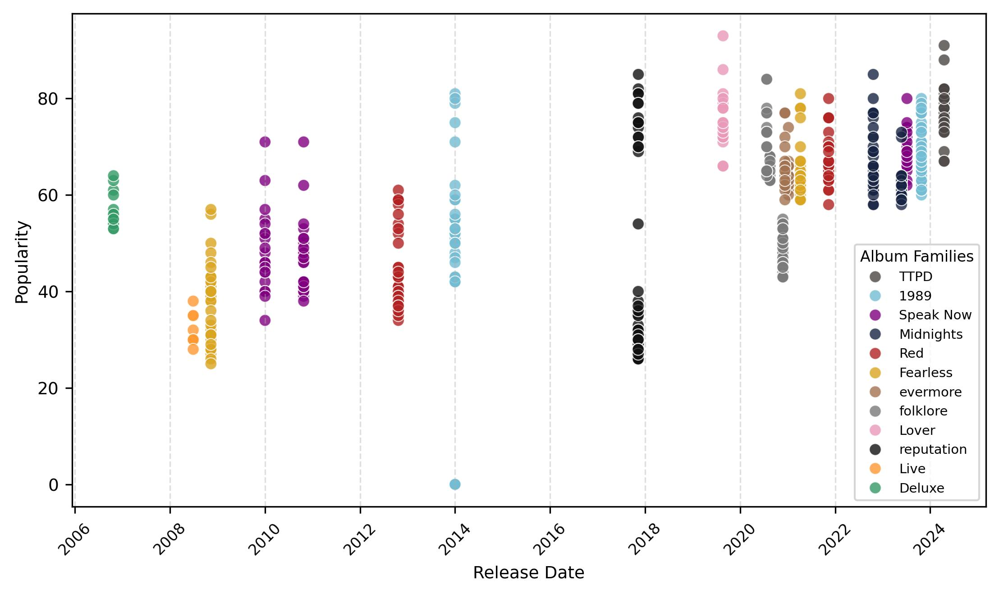
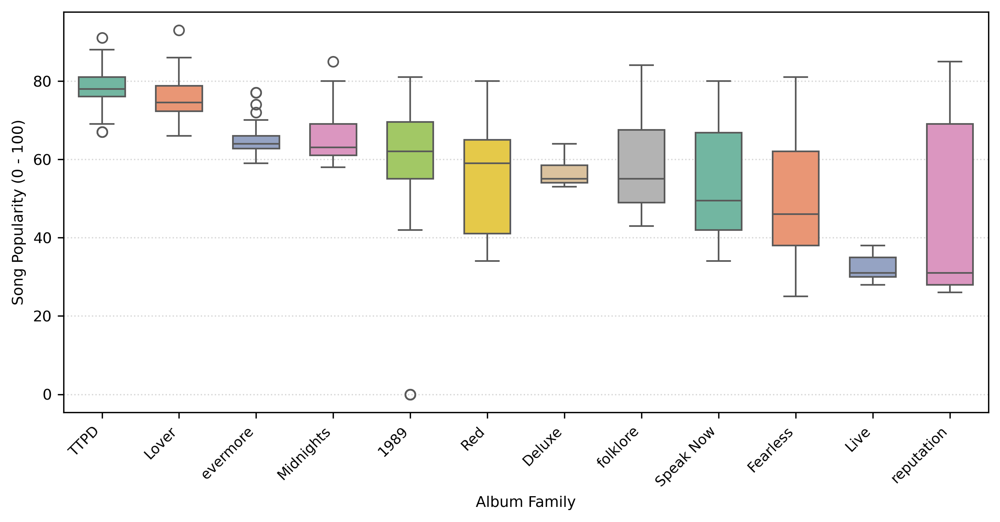

# 🎵 Taylor Swift Spotify Catalog - Exploratory Data Analysis (EDA)

An empirical Exploratory Data Analysis (EDA) investigating audio descriptors, structural layout, metadata parameters, and popularity as the primary metric of interest across Taylor Swift's Spotify discography.


---


## 📌 Project Overview & Variable Taxonomy

Digital streaming platforms have revolutionized how musical trends and artistic performance are quantified, empowering creators and record labels to make data-driven decisions that mitigate commercial risks. This research conducts a structured Exploratory Data Analysis (EDA) on Taylor Swift's Spotify catalog (582 rows, 18 columns). Her multi-decade career and diverse musical style make her catalog an ideal empirical landscape to explore how acoustic features interact with audience engagement over time.

The variables are classified into four metadata-defined categories:
* **Primary Metric of Interest (`int64`):** `popularity` (0 to 100 score calculated by Spotify based on stream volume and recency).
* **Audio Descriptors (`float64`):** Continuous acoustic features (`acousticness`, `danceability`, `energy`, `instrumentalness`, `liveness`, `speechiness`, `valence`, `loudness`, `tempo`).
* **Structural Layout Parameters (`int64`):** Spatial and sequencing parameters (`track_number`, `duration_ms`).
* **Identification & Metadata Parameters (`object`):** Metadata attributes (`name`, `album`, `id`, `uri`, `release_date`).
---

## 📁 Repository Structure

```text
taylor-swift-spotify-eda/
│
├── EDA_final_project.ipynb # Data Preprocessing, Univariate & Multivariate Notebook
├── taylor_swift_spotify.csv # Raw Spotify Dataset (582 records, 18 columns)
├── EDA Final Project Kerem Bar.pdf # Comprehensive EDA Academic Research Report
├── README.md # Repository Documentation & Findings
├── Figure1.png # Univariate Popularity Distribution & Box Plot
├── Figure2.png # Univariate Danceability Distribution & Box Plot
├── Figure3.png # Univariate Frequency across Engineered Album Families
├── Figure4.jpg # Pearson Correlation Matrix Heatmap
├── Figure5.jpg # Popularity vs. Release Date (Temporal Dynamics)
└── Figure6.png # Popularity Distribution across Album Families Box Plot

```

---

## 🔬 Methodology & Key Analysis Findings

### 1. Data Cleaning & Preprocessing

* **Outlier & Anomaly Isolation:** Isolated 3 non-musical voice memo records from *1989 (Deluxe Edition)* with exact 0 popularity scores.
* **Structural Album Clustering:** Resolved catalog re-recording fragmentation by engineering 12 high-level `album_families` categorical groups and shortening titles for plot layout optimization, compressing *THE TORTURED POETS DEPARTMENT* to `TTPD`, *Taylor Swift (Deluxe Edition)* to `Deluxe`, and *Live From Clear Channel* to `Live`.
* **Dual Temporal Feature Engineering:** Implemented functional separation by creating two distinct engineered time features from the raw `release_date`:
  * **`release_year` (`int`):** Extracted via 4-character slicing to create an active numerical element for macro-level statistical correlations and trend analysis.
  * **`release_date_D` (`datetime`):** Converted raw text into a standardized pandas Datetime object to preserve precise day and month metadata for high-resolution scatter plot placement (Figure 5).
### 2. Univariate Analysis

* **Popularity Distribution (Figure 1):** Mean = 57.86, Median = 62.00, Mode = 63.00, Min = 0.00, Max = 93.00, SD = 16.15, Skewness = -0.533. Left-skewed distribution. While the histogram visually suggests potential right-tail outliers above 90, the box plot mathematically disproves this: the upper statistical fence sits at 107.5 (exceeding Spotify's physical 100-point limit). Consequently, high-streaming tracks reflect true catalog performance rather than anomalies, leaving the 3 voice memos from *1989 (Deluxe Edition)* with 0 popularity (below the 7.5 lower fence) as the sole statistical outliers.
* **Danceability Distribution (Figure 2):** Mean = 0.581, Median = 0.594, Mode = 0.604, Min = 0.175, Max = 0.897, SD = 0.115, Skewness = -0.265. Approximately symmetric bell-curve distribution. Upper outliers exposed severe catalog redundancy driven by 3 repeated entries of a single track across expanded album editions.
* **Sample Distribution (Figure 3):** Categorical frequency across 12 engineered `album_families` revealed severe sample imbalance, ranging from `1989` as the maximum/mode with 75 tracks (72 musical tracks plus the 3 voice memo outliers) to `Live` as the minimum with only 8 tracks.
### 3. Multivariate Analysis

* **Correlation Analysis (Figure 4):** Strong linear positive association between `popularity` and `release_year` ($r = 0.63$). Identified severe multicollinearity risk between `energy` and `loudness` ($r = 0.79$) and strong negative correlation between `loudness` and `acousticness` ($r = -0.73$).
* **Temporal Dynamics & Re-recordings (Figure 5):** Maps `popularity` against continuous release dates (`release_date_D`) across `album_families`, highlighting key temporal patterns:
  * **Recency Effect:** Post-2020 releases sustain elevated popularity scores (heavily clustering between 60–80+).
  * **Re-recording Shift:** Modern re-recorded albums (*"Taylor's Version"*) demonstrate dramatic upward popularity shifts compared to their original releases.
  * **Outlier Isolation:** Visually isolates the 3 non-musical voice memo outliers overlapping at 0 popularity in late 2014 within the `1989` album family.

* **Catalog Dispersion & Localized Era Anomalies (Figure 6):** Evaluates track popularity across engineered `album_families` (eras), uncovering three key dynamics:
  * **Inter-Era Temporal Decay:** Newer `album_families` exhibit lower variance and narrower Interquartile Ranges (IQR) clustered at high popularity scores, whereas older eras show higher variance and wider IQRs as time spreads catalog performance.
  * **Intra-Era Re-recording Variance:** `album_families` combining original releases with modern *Taylor's Version* re-recordings display significantly wider IQRs than single-release eras, driven by the popularity gap between original masters and re-recorded editions.
  * **Localized Anomalies vs. Global Baselines:** Flat global baselines (Mean = 57.86, Median = 62.00) completely mask era-specific behavior, whereas localized screening using family-specific statistical fences isolates true micro-anomalies:
    * **`evermore` (2020):** Localized fences (57.88–70.88) isolate *"willow"* (popularity: 77) as a positive anomaly within a quieter indie-folk era, despite sitting within standard global parameters.
    * **`TTPD` (2024):** Localized fences (68.50–88.50) isolate *"Fortnight"* (popularity: 91) above the upper fence, and *"Clara Bow"* (popularity: 67) as an underperforming anomaly within this specific era, despite sitting well above global baselines.
## 💡 Conclusions & Downstream Predictive Modeling Guidelines

This EDA directly informs future machine learning tasks by establishing explicit data-structuring and modeling requirements:

* **Mandatory Outlier Filter:** The 3 non-musical voice memo outliers must be removed prior to fitting linear models to prevent severe parameter distortion and artificial variance inflation.
* **Minimum Category Sample Thresholds:** To address group sample imbalance and high statistical variance in smaller categories (e.g., `Live` family with n = 8), downstream modeling must enforce minimum sample size thresholds per `album_families`.
* **Model-Specific Multicollinearity Management:** The high linear correlation between `energy` and `loudness` (r = 0.79) poses a multicollinearity risk in linear regression (requiring feature reduction or PCA), whereas both features can safely be retained in tree-based ensemble algorithms.
* **Localized Era & Temporal Framework (Preventing Pooling Bias):** `popularity` remains the core target variable. Pearson correlation analysis revealed that temporal progression (`release_year`, r = 0.63) heavily outweighs standalone acoustic features as a primary driver of streaming performance. However, its predictive power is best captured when contextualized dynamically within individual `album_families`. Evaluating at this localized micro level prevents global pooling bias from masking era-specific anomalies (such as those isolated within *evermore* and *TTPD*).
---

## 📊 Visualizations Highlights

| Figure 1: Popularity Distribution | Figure 2: Danceability Distribution |
| :---: | :---: |
|  |  |
| *Histogram & Box Plot isolating voice memo outliers.* | *Distribution curve identifying catalog redundancies.* |

| Figure 3: Album Families Count Plot | Figure 4: Correlation Matrix Heatmap |
| :---: | :---: |
|  |  |
| *Sample frequency across 12 engineered album families.* | *Pearson correlation heatmap identifying feature risk.* |

| Figure 5: Popularity vs. Release Date Dynamics | Figure 6: Popularity by Album Family |
| :---: | :---: |
|  |  |
| *Scatter plot illustrating recency & re-recording impact.* | *Box plot highlighting localized era variance & anomalies.* |
---

## 🛠️ Tech Stack & Methods

* **Language:** Python 3.10+
* **Data Manipulation & Analysis:** Pandas, NumPy
* **Data Visualization:** Matplotlib, Seaborn
* **Statistical Techniques:** 
  * Descriptive Statistics & Central Tendency (Mean, Median, Mode)
  * Dispersion & Variance Metrics (Min, Max, Range, Standard Deviation, Interquartile Range)
  * Distribution Shape & Central Tendency Overlay (Skewness, Mean/Median/Mode Reference Lines)
  * Outlier Detection (IQR Statistical Fences)
  * Association & Multicollinearity Analysis (Pearson Correlation Coefficient)
  * Feature Engineering (Categorical Structural Clustering, Temporal Slicing & Type Conversion)

---

## 🚀 How to Run

1. Clone the repository:
```bash
git clone [https://github.com/Kerem-Bar/taylor-swift-spotify-eda.git](https://github.com/Kerem-Bar/taylor-swift-spotify-eda.git)

```


2. Install dependencies:
```bash
pip install pandas matplotlib seaborn numpy

```


3. Open and execute the notebook:
```bash
jupyter notebook EDA_final_project.ipynb

```


---

## 👤 Author

**Kerem Bar**

* Master's Student in Information Sciences (Information Technology Specialization)

